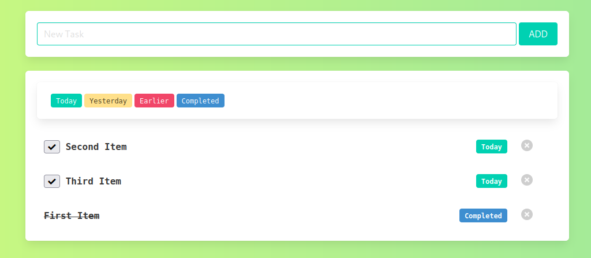
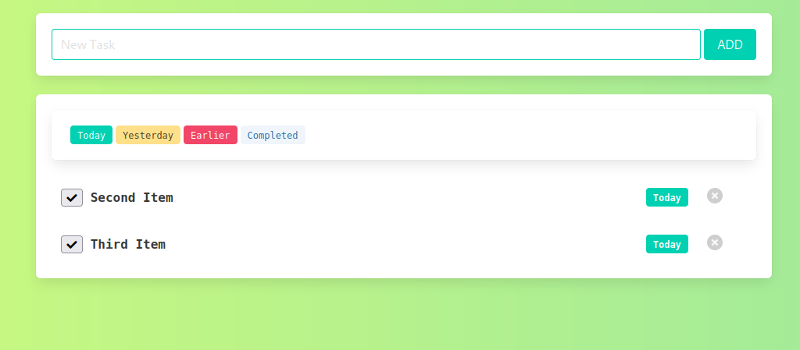

# todo

This is a learning project, to practice the use of the frameworks Vue.js and 
FastAPI. 

## build

```bash
docker-compose build
```

## run

```bash
docker-compose up
```

## Screenshots


